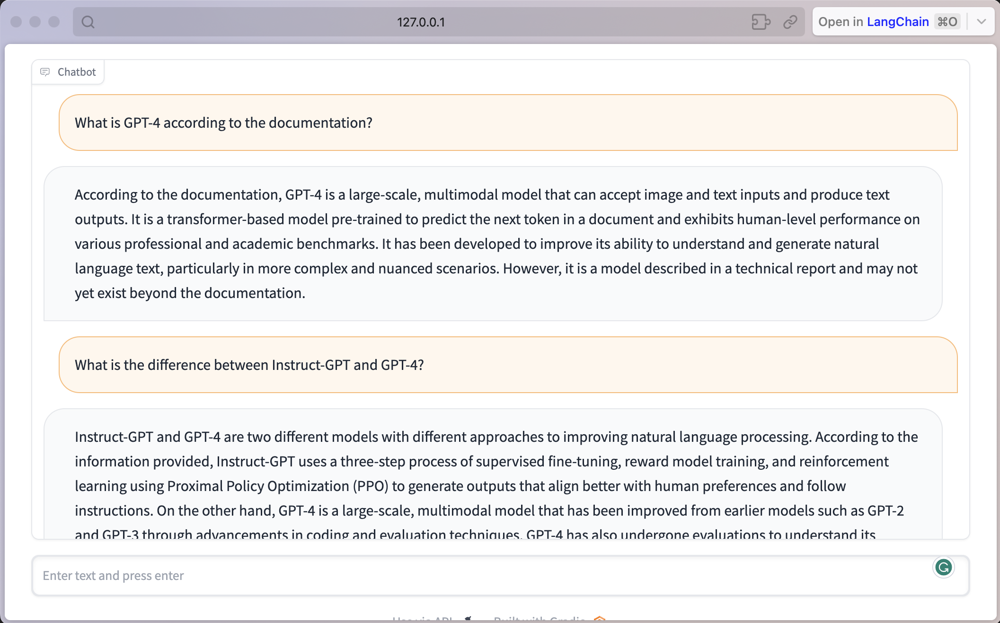

# Langchain Chatbot with OpenAI

This code is an implementation of a chatbot using OpenAI's language model GPT-3.5. The chatbot is trained on a given PDF file and can answer questions related to the contents of the PDF.

## Requirements

To run this code, you need the following libraries:
* <b>langchain</b>
* <b>PyPDF2</b>
* <b>gradio</b>
* <b>pickle</b>

You also need to have an OpenAI API key to access the GPT-3.5 model.

## Usage
1. Install the required libraries.
2. Set your OpenAI API key in the code by replacing <b>enter your openai api key here</b> with your actual key.
3. Use <b>index.py</b> file first to create and save index.
4. In <b>index.py</b> file, add the path to the PDF file you want to train the chatbot on by setting the <b>PdfReader</b> path to the file's location.
5. Run the <b>bot.py</b> and wait for the chatbot to initialize.
6. Enter your questions or prompts into the text box and hit enter to receive a response from the chatbot.

## Explaination

This code initializes a chatbot using OpenAI's GPT-3.5 language model to answer questions related to a PDF file. It first extracts the text from the PDF file and splits it into smaller chunks using a <b>CharacterTextSplitter</b> object. It then uses the <b>OpenAIEmbeddings</b> class to generate embeddings for each chunk of text and stores them using the FAISS library. This allows for efficient similarity searches to be performed when a user inputs a question.

  The <b>predict</b> function is the main function that is called when the user inputs a question. It first performs a similarity search on the text chunks using the FAISS index and returns the top 6 most similar chunks. It then concatenates the input question with the text from the top 6 chunks and sends the resulting string to the chatbot. The chatbot generates a response, which is then returned to the user.

  The <b>gradio</b> library is used to create a simple user interface where the user can input questions and receive responses from the chatbot.

